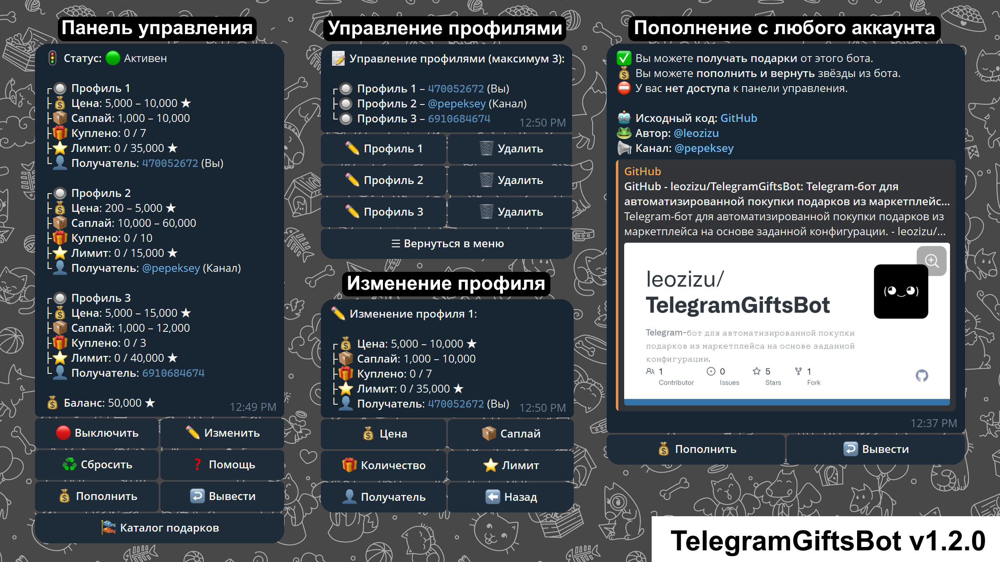

# 🎁 TelegramGiftsBot

Телеграм-бот для автоматизированной покупки подарков из маркетплейса. Поддерживает работу как от имени бота, так и через подключение собственной сессии Telegram-аккаунта (юзербота). Возможна настройка профилей и полная автоматизация покупок. Без комиссий. Исходный код открыт для всех.

офиц гитхаб https://github.com/leozizu/TelegramGiftsBot

## 📦 Возможности

- Покупка подарков по заданным фильтрам: минимальная/максимальная цена, саплай и количество покупок.
- Поддержка работы как от имени бота, так и юзербота — можно подключить свою Telegram-сессию и покупать напрямую от аккаунта.
- Возможность подключения SOCKS5-прокси для юзербота и aiohttp-сессии.
- Параллельная проверка списка подарков сразу с двух источников (бот + юзербот) — выбирается лучший актуальный вариант.
- Возможность добавить до 3-х независимых профилей с разными получателями и лимитами.
- Уведомления при успешных покупках и завершении задач.
- Управление через интерактивное меню прямо в Telegram.
- Счётчик покупок и автоматическая остановка при достижении лимита.
- Пополнение и возврат средств через Telegram Stars.
- Возможность пополнения баланса с любого аккаунта.
- Тест бота через покупку подарка за 15 звёзд.
- Вызов каталога всех подарков и покупка конкретного подарка в заданном количестве.
- Возврат всех звёзд с бота одной командой.

---

## 🚀 Быстрый старт

**1. Клонируйте репозиторий:**
   ```bash
   git clone https://github.com/leozizu/TelegramGiftsBot.git
   cd TelegramGiftsBot
   ```

**2. Установите зависимости:**
   ```bash
   pip install -r requirements.txt
   ```

**3. Создайте файл `.env`**

  В корне проекта создайте файл с именем `.env`. Этот файл используется для хранения переменных окружения.

**Пример:**
```env
TELEGRAM_BOT_TOKEN="123456:abcdefghijklmnopqrstuvwxyz"
TELEGRAM_USER_ID="123456789"
```

- `TELEGRAM_BOT_TOKEN` — токен вашего Telegram-бота, полученный через [@BotFather](https://t.me/BotFather)
- `TELEGRAM_USER_ID` — ваш Telegram user ID (узнать можно через [@userinfobot](https://t.me/userinfobot))

**4. Запустите бота:**
   ```bash
   python main.py
   ```

## 📂 Структура

- `main.py` — основной скрипт и точка входа бота
- `requirements.txt` — зависимости проекта
- `.env` — файл с переменными окружения (не включается в git)
- `config.json` — файл с пользовательской конфигурацией (не включается в git)
- `handlers/` — обработчики (handlers_main.py, handlers_wizard.py и др.)
- `middlewares/` — мидлвари для управления доступом и другими аспектами обработки апдейтов
- `services/` — бизнес-логика и менеджер подарков (balance.py, buy.py, config.py, menu.py и др.)
- `utils/` — утилиты и вспомогательные скрипты (logging.py, misc.py, mockdata.py, proxy.py)

## 🛠 Для разработчиков

- Все хендлеры хранятся в `handlers/`, вы можете добавлять свои сценарии, создавая новые файлы.
- Основная бизнес-логика вынесена в `services/` — удобно для переиспользования и тестирования.
- В `utils/` — вспомогательные функции, которые можно расширять без риска сломать логику ядра.
- В `middlewares/` — кастомные промежуточные обработчики (например, контроль доступа, логирование).

## 📝 Changelog

### v1.3.0 (2025-07-18)
- Добавлена возможность подключать Telegram-сессию (юзербот)
- Удалена возможность запрашивать вывод звёзд с других аккаунтов
- Владелец бота может вернуть звёзды пользователю по его user_id и transaction_id
- Добавлена возможность переименовывать профиль
- Оптимизирован код и улучшена структура проекта

### v1.2.0 (2025-06-28)
- Добавлены профили для покупки подарков
- Поддержка пополнения баланса бота с любых аккаунтов
- Добавлена защита от спама
- Улучшен код и структура проекта

### v1.1.0 (2025-06-21)
- Добавлен каталог подарков с выбором количества для покупки
- Поддержка возврата всех звёзд одной командной
- Улучшена структура проекта

### v1.0.1 (2025-06-16)
- Добавлена возможность тестовой покупки подарка

### v1.0.0 (2025-06-15)
- Первая рабочая версия: покупка подарков, настройка фильтров, учёт баланса

## 📸 Скриншоты

Главное меню бота:  


---

## ☁️ Хостинг без сервера

Если вы не хотите разбираться с VPS и настройкой окружения — воспользуйтесь **готовым Telegram-хостингом**.

Бот [@GiftsHostingBot](https://t.me/GiftsHostingBot) позволяет подключить данный бот для покупки подарков за **пару секунд**.


### ⚙️ Как это работает?

1. Получите токен у [@BotFather](https://t.me/BotFather) (команда `/newbot`).
2. Откройте [@GiftsHostingBot](https://t.me/GiftsHostingBot) и отправьте команду `/addbot`.
3. Введите токен — бот будет активирован на сервере.

### 💡 Почему это удобно?

- Никакой установки и конфигурации
- Всё работает автоматически на сервере
- Можно подключить несколько ботов
- Доступно даже без технических знаний

### 🛡 Безопасность

- Токен никогда не сохраняется в открытом виде.
- Вы можете в любой момент отключить бота через [@BotFather](https://t.me/BotFather), команда `/revoke`.
- ☎️ Помощь с настройкой и хостингом: по запросу

---

## 🧑‍💻 Поддержка

- Telegram-аккаунт: [@leozizu](https://t.me/leozizu)
- Telegram-канал: [@pepeksey](https://t.me/pepeksey)

---

## 📜 Лицензия

Этот проект распространяется под лицензией MIT.
